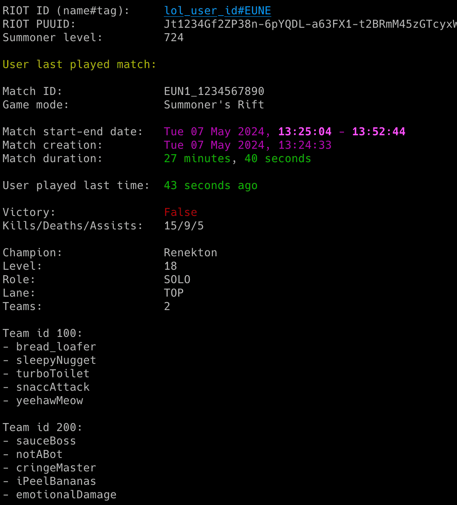
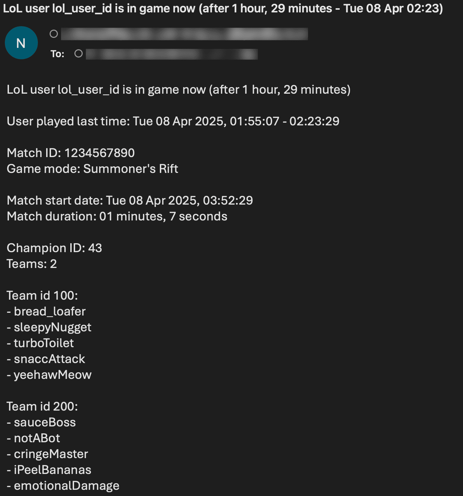

# lol_monitor

lol_monitor is a Python script which allows for real-time monitoring of LoL (League of Legends) players activity. 

**NOTE: This is new version of the tool rewritten from Cassiopeia to pulsefire library. More details [here](RELEASE_NOTES.md)**

## Features

- Real-time monitoring of LoL users gaming activity (including detection when user starts/finishes the match)
- Most important statistics for finished matches:
   - game mode
   - victory/defeat 
   - kills/deaths/assists
   - champion name
   - achieved level
   - role
   - lane
   - team members
- Email notifications for different events (player starts/finishes the match, match summary, errors)
- Saving all gaming activity with timestamps to the CSV file
- Possibility to control the running copy of the script via signals

<p align="center">
   
</p>

## Change Log

Release notes can be found [here](RELEASE_NOTES.md)

## Disclaimer

I'm not a dev, project done as a hobby. Code is ugly and as-is, but it works (at least for me) ;-)

## Requirements

The script requires Python 3.x.

It uses [pulsefire](https://github.com/iann838/pulsefire) library, also requests and python-dateutil.

It has been tested succesfully on Linux (Raspberry Pi Bullseye & Bookworm based on Debian) and Mac OS (Ventura & Sonoma). 

Should work on any other Linux OS and Windows with Python.

## Installation

Install the required Python packages:

```sh
python3 -m pip install requests python-dateutil pulsefire
```

Or from requirements.txt:

```sh
pip3 install -r requirements.txt
```

Copy the *[lol_monitor.py](lol_monitor.py)* file to the desired location. 

You might want to add executable rights if on Linux or MacOS:

```sh
chmod a+x lol_monitor.py
```

## Configuration

Edit the *[lol_monitor.py](lol_monitor.py)* file and change any desired configuration variables in the marked **CONFIGURATION SECTION** (all parameters have detailed description in the comments).

### RIOT API key

You can get the development RIOT API key valid for 24 hours here: [https://developer.riotgames.com](https://developer.riotgames.com)

However in order to make full use of the tool you need to apply for persistent personal or production RIOT API key here: [https://developer.riotgames.com/app-type](https://developer.riotgames.com/app-type)

It takes few days to get the approval.

Change the **RIOT_API_KEY** variable to respective value (or use **-r** parameter).

### SMTP settings

If you want to use email notifications functionality you need to change the SMTP settings (host, port, user, password, sender, recipient).

### Other settings

All other variables can be left at their defaults, but feel free to experiment with it.

## Getting started

### List of supported parameters

To get the list of all supported parameters:

```sh
./lol_monitor.py -h
```

or 

```sh
python3 ./lol_monitor.py -h
```

### Monitoring mode

To monitor specific user activity, just type player's LoL RIOT ID & region as parameters (**misiektoja#EUNE** and **eun1** in the example below):

```sh
./lol_monitor.py "misiektoja#EUNE" eun1
```

LoL RIOT ID consists of RIOT ID game name (*misiektoja* in the example above) and tag line (*#EUNE*). 

For the region you need to use short form of it. You can find a list in [lol_monitor.py](lol_monitor.py) file, look at the **regions_short_to_long** dictionary.

The tool will run infinitely and monitor the player until the script is interrupted (Ctrl+C) or killed the other way.

You can monitor multiple LoL players by spawning multiple copies of the script. 

It is suggested to use sth like **tmux** or **screen** to have the script running after you log out from the server.

The tool automatically saves its output to *lol_monitor_riotidname.log* file (can be changed in the settings or disabled with -d).

### Listing mode

There is also other mode of the tool which prints and/or saves the recent matches for the user (**-l** parameter). You can also add **-n** to define how many recent matches you want to display/save, by default it shows 2 last matches:

```sh
./lol_monitor.py "misiektoja#EUNE" eun1 -l -n 25
```

You can also define the range of matches to display/save by specyfing the minimal match to display (**-m** parameter). So for example to display recent matches in the range of 20-50:

```sh
./lol_monitor.py "misiektoja#EUNE" eun1 -l -m 20 -n 50
```

If you specify **-b** parameter (with CSV file name) together with **-l** parameter, it will not only display the recent matches, but also save it to the specified CSV file. For example to display and save recent matches in the range of 5-10 for the user:

```sh
./lol_monitor.py "misiektoja#EUNE" eun1 -l -m 5 -n 10 -b lol_games_misiektoja.csv
```

You can use the **-l** functionality regardless if the monitoring is used or not (it does not interfere). 

## How to use other features

### Email notifications

If you want to get email notifications once the user starts/finishes the match use **-s** parameter:

```sh
./lol_monitor.py "misiektoja#EUNE" eun1 -s
```

Make sure you defined your SMTP settings earlier (see [SMTP settings](#smtp-settings)).

Example email:

<p align="center">
   
</p>

### Saving gaming activity to the CSV file

If you want to save the gaming activity of the LoL user, use **-b** parameter with the name of the file (it will be automatically created if it does not exist):

```sh
./lol_monitor.py "misiektoja#EUNE" eun1 -b lol_games_misiektoja.csv
```

### Check intervals

If you want to change the check interval when the user is in game to 60 seconds (**-k**) and when is NOT in game to 2 mins - 120 seconds (**-c**):

```sh
./lol_monitor.py "misiektoja#EUNE" eun1 -k 60 -c 120
```

### Controlling the script via signals


The tool has several signal handlers implemented which allow to change behaviour of the tool without a need to restart it with new parameters.

List of supported signals:

| Signal | Description |
| ----------- | ----------- |
| USR1 | Toggle email notifications when user starts/finishes the match |
| TRAP | Increase the check timer for player activity when user is in game (by 30 seconds) |
| ABRT | Decrease check timer for player activity when user is in game (by 30 seconds) |

So if you want to change functionality of the running tool, just send the proper signal to the desired copy of the script.

I personally use **pkill** tool, so for example to toggle email notifications when user starts/finishes playing the game, for the tool instance monitoring the *misiektoja* user:

```sh
pkill -f -USR1 "python3 ./lol_monitor.py misiektoja"
```

### Other

Check other supported parameters using **-h**.

You combine all the parameters mentioned earlier in monitoring mode (listing mode only supports **-l**, **-n**, **-m** and **-b**).

## Colouring log output with GRC

If you use [GRC](https://github.com/garabik/grc) and want to have the output properly coloured you can use the configuration file available [here](grc/conf.monitor_logs)

Change your grc configuration (typically *.grc/grc.conf*) and add this part:

```
# monitoring log file
.*_monitor_.*\.log
conf.monitor_logs
```

Now copy the *conf.monitor_logs* to your .grc directory and lol_monitor log files should be nicely coloured.

## License

This project is licensed under the GPLv3 - see the [LICENSE](LICENSE) file for details
